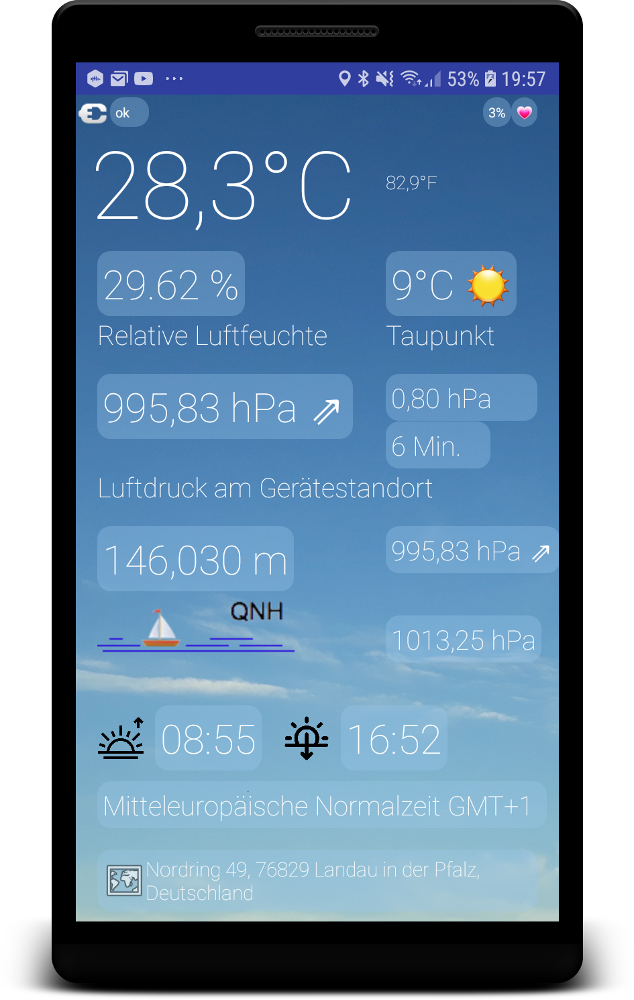

Local Temperature
=================

Local Temperature is a Hard-/ Software Project which demonstrates  how to connect a DHT11 temperature sensor and a BMP0180 pressure sensor to a HC05 bluetooth- module and how the data obtained from the sensors can be send via a bluetooth connection to an Android device.

Sending via HC05- module is conducted by the Arduino Tensy 2.0 microcontroller.

The source code for the Android app and the Tensy 2.0 firmeware can be found in this repository.

- [Source code for Arduino](arduino_source/Hc05_Temperatur_Sensor)

- [APK for Android](app/release)

More information about the project can be found here:[CodingByChanche Blog, Bluetooth Thermometer](https://codingbychance.wordpress.com/2019/01/21/bluetooth-termometer/#more-640) (German language blog).

Screenshoot
===========

[APK for Android](app/release/app-release.apk)

Schemantic
==========

PCB
===

Icons made by <a href="https://www.flaticon.com/authors/freepik" title="Freepik">Freepik</a> from <a href="https://www.flaticon.com/" title="Flaticon"> www.flaticon.com</a>
